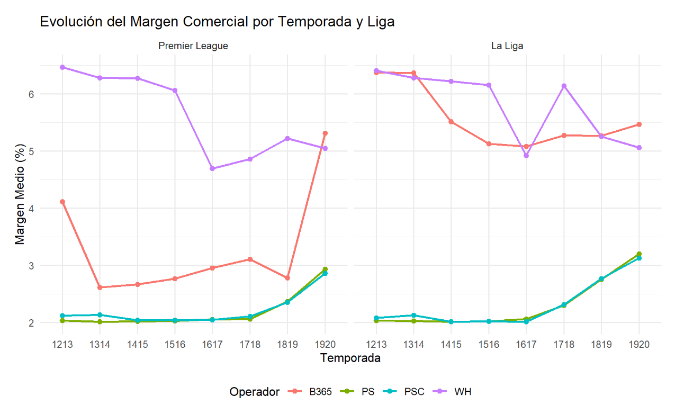

# ¿Están bien calibradas las casas de apuestas?


## Autores

- Elias Jose Parra Royero
- Maria Monica Murillo Rincon

Análisis metodológico de las probabilidades implícitas en cuotas 1X2 (Victoria Local / Empate / Victoria Visitante). El proyecto no busca una estrategia de apuestas — evalúa, con rigor estadístico, qué tan bien calibradas están las probabilidades que publican distintas casas de apuestas frente a lo que realmente ocurre en los partidos.

**El margen de las casas garantiza, en promedio, un valor esperado negativo para quien apuesta.** Este trabajo no intenta vencer esa ventaja: audita la calidad de un pronóstico ajeno, el mismo ejercicio que se aplica a modelos de riesgo crediticio, pronóstico del clima o mantenimiento predictivo.

## Contenido
- [Alcance](#alcance)
- [Estructura del repositorio](#estructura-del-repositorio)
- [Requisitos previos](#requisitos-previos)
- [Preparar los datos](#preparar-los-datos-paso-manual-obligatorio-antes-de-correr-el-flujo)
- [Cómo correr el análisis completo](#cómo-correr-el-análisis-completo)
- [Qué hace cada fase](#qué-hace-cada-fase)
- [Metodología — decisiones relevantes](#metodología--decisiones-relevantes)
- [Encuadre](#encuadre)

## Alcance

| | |
|---|---|
| **Ligas** | Premier League (E0), La Liga (SP1) |
| **Temporadas** | 2012/13 a 2019/20 (8 temporadas) |
| **Operadores principales** | B365, PS (Pinnacle, previo al cierre), PSC (Pinnacle, cierre), WH |
| **Fuente de datos** | [football-data.co.uk](https://www.football-data.co.uk/data.php) |

Todo el alcance (ligas, temporadas, operadores) y los parámetros metodológicos (número de intervalos, réplicas bootstrap, semilla, fechas de corte) se controlan desde un único archivo: `config.R`. No hay valores hardcodeados en ningún otro script.

> **Nota sobre Pinnacle:** football-data.co.uk advierte que las cuotas de Pinnacle publicadas después del 23 de julio de 2025 son poco confiables (su API de entrega quedó desactualizada). El alcance de este proyecto (2012–2019) es anterior a esa fecha, por lo que no afecta ningún resultado. Aun así, el flujo incluye una guarda en la Fase 1: si se amplía el alcance a temporadas posteriores, las cuotas PS/PSC de los partidos desde esa fecha se anulan (NA) automáticamente para no medir un artefacto de recolección. La fecha de corte y los prefijos afectados se definen en `config.R`.

 *Ejemplo de salida del reporte autogenerado (outputs/reporte_calibracion.html)*


## Estructura del repositorio

```
.
├── config.R              # Único archivo a tocar para cambiar alcance y parámetros
├── run_all.R              # Script maestro: ejecuta todo el flujo de punta a punta
├── scripts/
│   ├── 0.Renombre de las bases de datos.R   # Detecta liga/temporada y renombra los CSV descargados
│   ├── 1. Limpieza de datos.R                # Consolidación, validación, guarda Pinnacle, inventario de cobertura
│   ├── 2. Margen y probabilidades.R          # Conversión a probabilidades, remoción del margen
│   ├── 3. Evaluación de calibración.R        # Curvas de calibración, Brier, RPS, Murphy, Hosmer-Lemeshow, inferencia apareada
│   ├── 4. Desviaciones sistemáticas.R        # Sesgo favorito-longshot, apertura vs. cierre
│   ├── 5. comparación ligas.R                # Comparación Premier League vs. La Liga
│   └── 6. Reporte de Calibración.Rmd         # Reporte autogenerado (entregable 3)
├── data/
│   ├── raw/               # CSV originales (NO versionados — ver "Preparar los datos")
│   └── processed/         # Reservado, actualmente sin uso activo en el flujo
├── documentos/
│   ├── bitacora_ia.md                                      # Bitácora de uso de IA (entregable 6)
│   ├── Margen Comercial.png                                 # Imagen de ejemplo usada en este README
│   └── INFORME TÉCNICO CALIBRACIÓN CASAS DE APUESTAS.pdf    # Informe técnico (entregable 5)
├── outputs/                # Todas las salidas del análisis (NO versionado, se regenera solo)
├── logs/                   # (NO versionado)
├── .gitattributes          # Fuerza saltos de línea LF en .R, .Rmd y .md
└── renv.lock                # Entorno reproducible de paquetes R
```

## Requisitos previos

- R (≥ 4.1 recomendado) y RStudio.
- Pandoc (viene incluido con RStudio; si corres el flujo fuera de RStudio, debe estar instalado y en el PATH).
- El proyecto usa [`renv`](https://rstudio.github.io/renv/) para fijar las versiones exactas de los paquetes. Al abrir `Betting_Sports_Project.Rproj` por primera vez, corre:

```r
renv::restore()
```

Esto instala automáticamente todos los paquetes necesarios (`data.table`, `dplyr`, `binom`, `sandwich`, `ggplot2`, `scales`, `rmarkdown`, `knitr`, entre otros) en las versiones exactas registradas en `renv.lock`.

## Preparar los datos (paso manual, obligatorio antes de correr el flujo)

La descarga de los datos **no está automatizada** — es un paso manual único que debes hacer antes de la primera corrida (o cada vez que amplíes el alcance a una liga/temporada nueva):

1. Ve a [football-data.co.uk/data.php](https://www.football-data.co.uk/data.php) y descarga el CSV de cada combinación liga-temporada dentro del alcance definido en `config.R` (por defecto: E0 y SP1, 2012/13 a 2019/20 → 16 archivos).
2. Coloca todos los CSV descargados, con cualquier nombre, dentro de `data/raw/`.
3. Corre `scripts/0.Renombre de las bases de datos.R`. Este script detecta automáticamente la liga y la temporada leyendo el contenido de cada archivo (columnas `Div` y `Date`, no el nombre del archivo) y los renombra al formato estándar que espera el resto del flujo: `{Liga}_{Temporada}.csv` (ej. `E0_1213.csv`).
4. Al final te dirá si las 16 combinaciones esperadas están completas, o cuáles faltan.

Si corres `run_all.R` sin haber hecho este paso, el flujo se detiene de inmediato con un error explícito ("No hay archivos .csv en data/raw") — es el comportamiento esperado, no un bug. Solo se puede arrancar desde una `base_consolidada.csv` ya generada si se define `USAR_BASE_CONSOLIDADA <- TRUE` de forma explícita; en ese caso el flujo emite una advertencia indicando que los resultados no se regeneraron desde los datos originales.

## Cómo correr el análisis completo

Con los datos ya en `data/raw/` (paso anterior) y el entorno restaurado (`renv::restore()`):

```r
source("run_all.R")
```

Esto ejecuta, en orden: renombrado de archivos (Fase 0), limpieza y consolidación (Fase 1), tratamiento del margen (Fase 2), evaluación de calibración (Fase 3), desviaciones sistemáticas (Fase 4), comparación entre ligas (Fase 5), y genera el reporte de calibración autogenerado (Fase 6) en `outputs/reporte_calibracion.html`.

`run_all.R` localiza cada script de fase por su número (`0.`, `1.`, ...) dentro de `scripts/`, de modo que no depende de tildes ni de la codificación de los nombres de archivo. Si se ejecuta desde una subcarpeta, ajusta solo el directorio de trabajo a la raíz del proyecto.

Todas las salidas (CSV y el reporte HTML) se escriben en `outputs/`, que se regenera por completo en cada corrida — no es necesario, ni se debe, editar nada ahí a mano. Los resultados con bootstrap son reproducibles porque la semilla (`SEMILLA`) está fijada en `config.R`.

> **Sobre el reporte (`outputs/reporte_calibracion.html`):** se genera únicamente a través de `run_all.R`. No lo renderices con el botón "Knit" de RStudio directamente sobre el `.Rmd` — al ejecutarse así, el `.Rmd` no resuelve correctamente la ruta a `config.R` y falla. El flujo soportado es siempre `run_all.R` completo. Todas las cifras del texto interpretativo del reporte se calculan a partir de los CSV de `outputs/`, por lo que se actualizan solas al cambiar el alcance en `config.R`.

## Qué hace cada fase

| Fase | Script | Qué produce |
|---|---|---|
| 0 | Renombre | Normaliza nombres de archivo en `data/raw/` |
| 1 | Limpieza | `base_consolidada.csv`, `inventario_cobertura.csv`, `filas_descartadas.csv`. Valida resultados, anula cuotas imposibles (≤ 1), aplica la guarda de Pinnacle y marca los partidos posteriores a la reanudación por COVID-19 |
| 2 | Margen | `base_con_probabilidades.csv`, `distribucion_margen.csv`, `sensibilidad_metodos.csv`, `aditivo_filas_anuladas.csv`, `shin_no_convergencia.csv` |
| 3 | Calibración | Curvas de calibración (Wilson y bootstrap por partido), Brier, RPS, descomposición de Murphy, Hosmer-Lemeshow por resultado, inferencia apareada entre casas (Friedman y Wilcoxon con Holm, IC bootstrap por bloques), sensibilidad al agrupamiento, al método de margen y a los partidos post-reanudación COVID-19 |
| 4 | Desviaciones | Sesgo favorito-longshot (Spearman, pendiente de calibración logística con error estándar por clúster, pendiente por resultado) y comparación apertura vs. cierre (Wilcoxon apareado e IC bootstrap de la diferencia de Brier y RPS) |
| 5 | Comparación de ligas | Margen, Brier y descalibración (fiabilidad de Murphy y desviación ponderada), Premier League vs. La Liga |
| 6 | Reporte | `outputs/reporte_calibracion.html` — consolida cobertura, margen, curvas, desviaciones, reglas de puntuación, inferencia apareada, sensibilidades, comparación entre ligas y limitaciones |

## Metodología — decisiones relevantes

- **Margen:** se aplican dos métodos obligatorios (multiplicativo, aditivo) a todos los operadores, más el método de Shin a los 4 operadores principales. Cuando el reparto aditivo produce una probabilidad negativa, la fila se anula (NA) en lugar de recortarse a 0, porque recortar rompería la suma a 1; las filas anuladas se registran en `aditivo_filas_anuladas.csv`. Los partidos donde Shin no converge se documentan en `shin_no_convergencia.csv`.
- **Muestra común apareada:** las Fases 3, 4 y 5 restringen el análisis entre operadores a los partidos donde los 4 operadores principales tienen cuotas completas, para que las comparaciones sean válidas y los N sean consistentes entre fases.
- **Comparación entre casas vs. apertura/cierre:** PS y PSC son la misma casa (Pinnacle) en dos momentos distintos. Por eso la comparación entre casas (Friedman y Wilcoxon) usa solo las cuotas previas al cierre (`OPERADORES_CASAS`), y la comparación apertura vs. cierre se hace aparte en la Fase 4 (`PAR_APERTURA_CIERRE`).
- **Independencia de observaciones:** cada partido aporta tres filas (H, D, A) que no son independientes entre sí. El test de Hosmer-Lemeshow se corre por separado para cada resultado, y los intervalos de las curvas de calibración se reportan con Wilson y también con bootstrap que remuestrea partidos completos. Los errores estándar de la pendiente de calibración usan un estimador robusto por clúster de partido.
- **Hosmer-Lemeshow:** al no haber un modelo ajustado, los grados de libertad no son únicos; se reporta el valor p con gl = G (intervalos ocupados) y, como sensibilidad, con gl − 1 y gl − 2. Se reporta siempre la magnitud de la desviación (puntos porcentuales, simple y ponderada por N) junto con el valor p.
- **Comparaciones múltiples:** se aplica corrección de Holm en las familias de pruebas que lo requieren (Hosmer-Lemeshow, sesgo favorito-longshot, comparación de Brier entre operadores).
- **Tamaño de los intervalos:** los intervalos con menos de `N_MIN_BIN` observaciones se marcan como poco confiables y no entran en los contrastes de tendencia.
- **Sensibilidades:** se evalúa si las conclusiones dependen del número de intervalos (5, 10 y 20), del método de remoción del margen y de incluir o no los partidos jugados a puerta cerrada tras la reanudación por COVID-19 (las fechas de reanudación por liga están en `config.R`).
- **Dependencia residual:** la dependencia más amplia entre partidos de una misma temporada/jornada (mismo equipo, mismo calendario) se aborda parcialmente con el bootstrap por bloques (liga-temporada-mes) y se declara como limitación en el informe técnico.

## Encuadre

Este proyecto es un ejercicio académico de evaluación de pronósticos probabilísticos. Ningún resultado, gráfico o conclusión debe interpretarse como recomendación de apuesta.